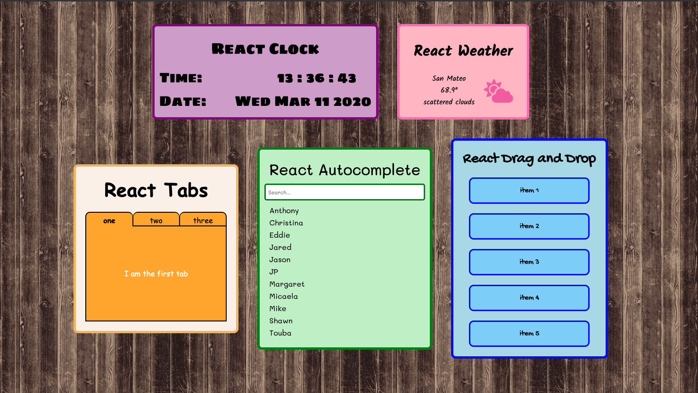

# React Widgets

[Live Link](https://ladymicaela.github.io/react-widgets/index.html)

## Background

I wanted to create a collection of simple widgets that I could use as a reference for future projects.

Currently the collection contains:

* A Clock
* Local Weather
* Tabs
* Autocomplete
* Drag and Drog
* Calculator
* Magic 8 Ball
* Dice Roller
* Notes
* Countdown

## Technologies

This project was implemented with the following technologies:
* JavaScript/React

## Libraries

* [react-beautiful-dnd](https://github.com/atlassian/react-beautiful-dnd)